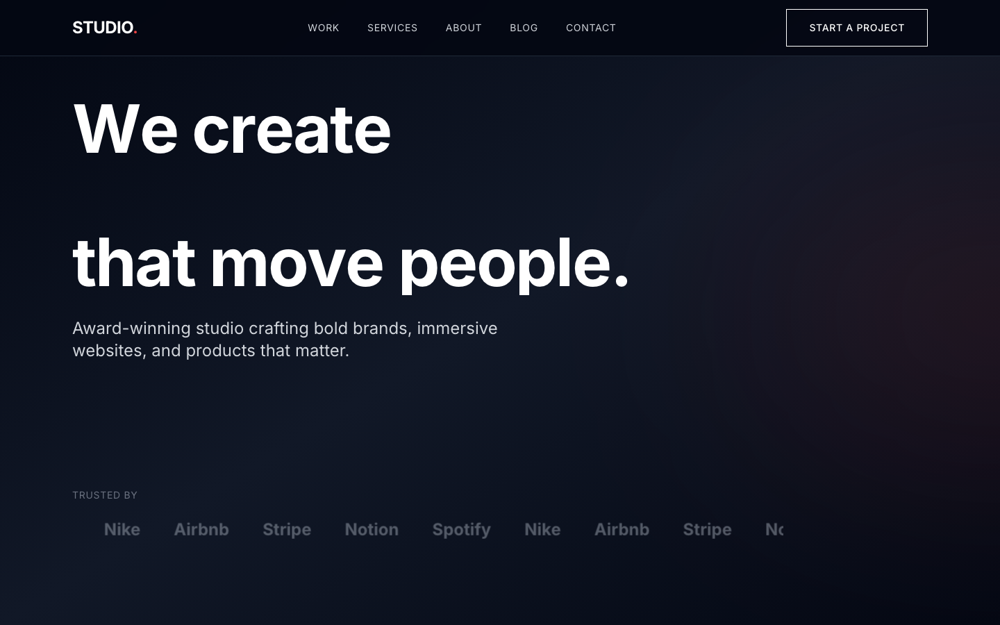

# Agency Portfolio Template

A bold, dark, portfolio-focused Next.js template for creative agencies. Features premium GSAP animations including SplitText, horizontal scroll galleries, and magnetic button effects.



## ✨ Features

### Design
- **Dark, premium aesthetic** - Bold typography and sophisticated color palette
- **Portfolio-focused layout** - Horizontal scroll work gallery with case study pages
- **Responsive design** - Optimized for desktop, tablet, and mobile
- **Smooth scrolling** - Lenis smooth scroll integration

### Animations (GSAP + Framer Motion)
- **SplitText headlines** - Character-by-character text reveals
- **Horizontal scroll gallery** - Pin-and-scroll work showcase with ScrollTrigger
- **Magnetic buttons** - Interactive hover effects
- **Counter animations** - Animated statistics on scroll
- **Parallax effects** - Layered depth throughout
- **Reduced motion support** - Respects `prefers-reduced-motion`

### Pages & Routes
- **Homepage** - Hero, work gallery, services, about, process, CTA
- **Work** - Filterable portfolio grid with category tabs
- **Work/[slug]** - Individual case study pages with results, gallery, testimonials
- **Services** - Detailed service offerings with pricing indicators
- **About** - Team, values, stats, clients, awards
- **Blog** - Category-filtered posts with featured article
- **Blog/[slug]** - Full article pages with related posts
- **Contact** - Contact form with info sidebar

### Components
- Reusable shared components (PageHero, ContactForm, FilterTabs, etc.)
- Custom cursor (optional)
- Mobile-responsive navigation with focus trapping
- Newsletter signup
- Breadcrumbs navigation

## 🚀 Quick Start

```bash
# Install dependencies
npm install

# Start development server
npm run dev

# Build for production
npm run build

# Start production server
npm start
```

## 📁 Project Structure

```
├── app/
│   ├── components/          # Homepage components
│   │   ├── Hero.tsx
│   │   ├── Nav.tsx
│   │   ├── Services.tsx
│   │   ├── About.tsx
│   │   ├── Process.tsx
│   │   ├── HorizontalWork.tsx
│   │   ├── CTA.tsx
│   │   ├── Footer.tsx
│   │   └── shared/          # Reusable components
│   ├── about/page.tsx
│   ├── blog/
│   │   ├── page.tsx
│   │   └── [slug]/page.tsx
│   ├── contact/page.tsx
│   ├── services/page.tsx
│   ├── work/
│   │   ├── page.tsx
│   │   └── [slug]/page.tsx
│   ├── types/index.ts       # TypeScript types
│   ├── layout.tsx
│   ├── page.tsx
│   └── globals.css
├── components/
│   └── CustomCursor.tsx
├── lib/
│   ├── gsap.ts              # GSAP configuration with plugins
│   └── lenis.tsx            # Smooth scroll provider
├── public/
├── screenshots/
└── tailwind.config.ts
```

## 🎨 Customization

### Brand Colors

Edit `tailwind.config.ts` to customize the color palette:

```ts
colors: {
  dark: {
    950: '#030014',  // Darkest background
    900: '#0a0a1a',  // Section backgrounds
    800: '#1a1a2e',  // Borders
    // ...
  },
  primary: {
    500: '#6366f1',  // Primary accent color
    400: '#818cf8',
    // ...
  },
}
```

### Typography

The template uses Inter as a fallback font. For production, download [Satoshi](https://www.fontshare.com/fonts/satoshi) and configure in `app/layout.tsx`:

```ts
import localFont from 'next/font/local'

const satoshi = localFont({
  src: [
    { path: '../public/fonts/Satoshi-Regular.woff2', weight: '400' },
    { path: '../public/fonts/Satoshi-Medium.woff2', weight: '500' },
    { path: '../public/fonts/Satoshi-Bold.woff2', weight: '700' },
  ],
  variable: '--font-satoshi',
})
```

### Content

All content is currently stored as static data in each page file. To connect to a CMS:

1. The template includes Sanity client dependencies
2. Replace static data with fetch calls in server components
3. Create corresponding Sanity schemas

### Adding Case Studies

Add new case studies in `app/work/[slug]/page.tsx`:

```ts
const CASE_STUDIES = {
  'your-project-slug': {
    title: 'Project Title',
    category: 'Brand Identity',
    client: 'Client Name',
    timeline: '8 weeks',
    services: ['Brand Strategy', 'Visual Design'],
    challenge: 'The problem you solved...',
    solution: 'How you solved it...',
    results: [
      { value: '200', suffix: '%', label: 'Metric Increase' },
    ],
    // ...
  }
}
```

## 🛠️ Tech Stack

- **Framework:** Next.js 14 (App Router)
- **Styling:** Tailwind CSS
- **Animations:** GSAP (with SplitText, ScrollTrigger) + Framer Motion
- **Smooth Scroll:** Lenis
- **TypeScript:** Full type safety
- **CMS Ready:** Sanity client included

## 📦 Dependencies

### Core
- `next` - React framework
- `react` / `react-dom` - UI library
- `typescript` - Type safety

### Animations
- `gsap` - Premium animation library
- `@gsap/react` - React integration
- `framer-motion` - Declarative animations

### Smooth Scroll
- `lenis` - Smooth scroll library

### CMS (Optional)
- `@sanity/client` - Sanity.io client
- `@sanity/image-url` - Image URL builder
- `next-sanity` - Next.js integration

## 🔧 Environment Variables

No environment variables required for basic usage. For CMS integration:

```env
NEXT_PUBLIC_SANITY_PROJECT_ID=your-project-id
NEXT_PUBLIC_SANITY_DATASET=production
```

## 📱 Browser Support

- Chrome (latest)
- Firefox (latest)
- Safari (latest)
- Edge (latest)

## ♿ Accessibility

- Skip to content link
- Focus trapping in mobile menu
- ARIA labels and roles
- Keyboard navigation
- Reduced motion support
- Semantic HTML structure

## 🚢 Deployment

### Vercel (Recommended)
```bash
npm i -g vercel
vercel
```

### Docker
```dockerfile
FROM node:18-alpine
WORKDIR /app
COPY package*.json ./
RUN npm ci
COPY . .
RUN npm run build
EXPOSE 3000
CMD ["npm", "start"]
```

### Static Export
```bash
# Add to next.config.js: output: 'export'
npm run build
# Deploy the 'out' folder
```

## 📄 License

MIT License - feel free to use for personal or commercial projects.

## 🤝 Credits

- Images: [Unsplash](https://unsplash.com)
- Font: [Satoshi](https://www.fontshare.com/fonts/satoshi) by Indian Type Foundry
- Icons: [Lucide](https://lucide.dev)

---

Built with ❤️ for creative agencies that refuse to blend in.
