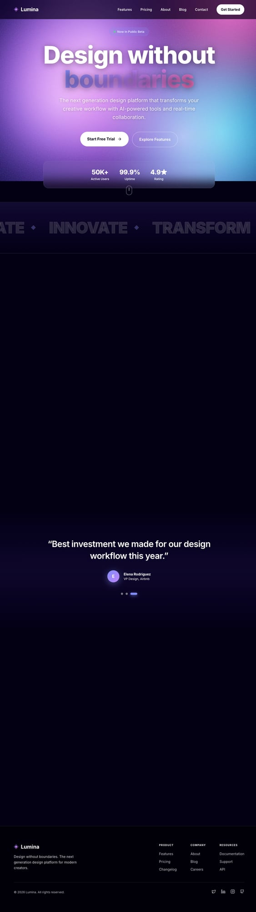

# Aurora Starter Template

A stunning Next.js 14 SaaS landing page template featuring a mesmerizing aurora gradient mesh background, glass-morphism UI components, and buttery-smooth animations powered by GSAP and Framer Motion.



## ✨ Features

### Design
- **Aurora Mesh Background** — Animated gradient mesh with luminous aurora-inspired colors
- **Glass-morphism UI** — Frosted glass cards with subtle borders and backdrop blur
- **Responsive Design** — Fully responsive across all device sizes (mobile, tablet, desktop)
- **Dark Theme** — Premium dark aesthetic with carefully crafted color palette
- **Grain Overlay** — Subtle texture for depth and visual interest

### Pages Included
- **Homepage** — Hero section, features grid, testimonials carousel, CTA sections
- **Features** — Filterable feature cards, comparison table, integrations showcase
- **Pricing** — Three-tier pricing with toggle (monthly/annual), FAQ accordion, trust badges
- **About** — Company timeline, values, team members, investors, careers CTA
- **Contact** — Contact form with validation, office locations, support resources
- **Blog** — Category filters, featured post, article cards, newsletter signup
- **Blog Post** — Article template with markdown rendering, related posts

### Animation & Interactions
- **Smooth Scrolling** — Lenis smooth scroll for buttery navigation
- **GSAP Animations** — Advanced animations with ScrollTrigger for reveal effects
- **Framer Motion** — Fluid page transitions and micro-interactions
- **Parallax Effects** — Depth through scroll-based parallax
- **Hover States** — Elevated card effects on hover
- **Loading States** — Skeleton loaders and transition states

### Accessibility
- **Semantic HTML** — Proper heading hierarchy and landmark regions
- **ARIA Labels** — Screen reader support for interactive elements
- **Keyboard Navigation** — Full keyboard accessibility
- **Skip Links** — Skip to main content for efficient navigation
- **Focus States** — Visible focus indicators

### Performance
- **Next.js 14 App Router** — Server-side rendering and React Server Components
- **Google Fonts** — Optimized font loading with `next/font`
- **Image Optimization** — Automatic image optimization via `next/image`
- **Code Splitting** — Automatic route-based code splitting

## 🚀 Quick Start

### Prerequisites
- Node.js 18+ 
- npm or yarn

### Installation

```bash
# Clone the template
npx create-next-app my-saas --example aurora-starter

# Or clone manually
git clone <repo-url> my-saas
cd my-saas

# Install dependencies
npm install

# Start development server
npm run dev
```

Open [http://localhost:3000](http://localhost:3000) to view your site.

## 📁 Project Structure

```
aurora-starter/
├── app/
│   ├── page.tsx           # Homepage
│   ├── layout.tsx         # Root layout with fonts & metadata
│   ├── globals.css        # Global styles & CSS variables
│   ├── features/page.tsx  # Features page
│   ├── pricing/page.tsx   # Pricing page
│   ├── about/page.tsx     # About page
│   ├── contact/page.tsx   # Contact page
│   └── blog/
│       ├── page.tsx       # Blog listing
│       └── [slug]/page.tsx # Blog post
├── components/
│   ├── nav.tsx            # Navigation with mobile menu
│   ├── footer.tsx         # Site footer
│   ├── page-layout.tsx    # Reusable page wrapper
│   ├── aurora-mesh.tsx    # Animated background
│   └── ui/
│       ├── glass-card.tsx # Glass-morphism card
│       ├── section-header.tsx # Section title component
│       └── accordion.tsx  # Expandable accordion
├── hooks/
│   └── useGsapAnimations.ts # GSAP animation hooks
├── lib/
│   ├── lenis.tsx          # Smooth scroll provider
│   └── gsap.ts            # GSAP configuration
└── screenshots/           # Template previews
```

## 🎨 Customization

### Colors

Edit CSS variables in `app/globals.css`:

```css
:root {
  --aurora-bg: #030014;
  --aurora-indigo: #818cf8;
  --aurora-violet: #a78bfa;
  --aurora-pink: #f472b6;
  --aurora-cyan: #22d3ee;
  --aurora-yellow: #fbbf24;
}
```

### Typography

Fonts are configured in `app/layout.tsx`:

```tsx
const spaceGrotesk = Space_Grotesk({
  subsets: ['latin'],
  variable: '--font-display',
})

const inter = Inter({
  subsets: ['latin'],
  variable: '--font-body',
})
```

### Content

All content is defined inline within page components for easy editing. Key data objects:
- `NAV_ITEMS` — Navigation links (`components/nav.tsx`)
- `FEATURES` — Feature cards (`app/page.tsx`)
- `TESTIMONIALS` — Customer quotes (`app/page.tsx`)
- `PLANS` — Pricing tiers (`app/pricing/page.tsx`)
- `TEAM` — Team members (`app/about/page.tsx`)
- `POSTS` — Blog articles (`app/blog/page.tsx`)

### Branding

1. Update logo text in `components/nav.tsx` and `components/footer.tsx`
2. Replace `◈` symbol with your logo/icon
3. Update meta tags in `app/layout.tsx`
4. Add your OG image to `public/og-image.png`

## 🔧 Configuration

### Environment Variables

Create `.env.local`:

```env
NEXT_PUBLIC_SITE_URL=https://your-domain.com
```

### Metadata

Update SEO metadata in `app/layout.tsx`:

```tsx
export const metadata: Metadata = {
  title: 'Your Brand | Tagline',
  description: 'Your description here...',
  // ...
}
```

## 📦 Tech Stack

| Technology | Purpose |
|------------|---------|
| [Next.js 14](https://nextjs.org) | React framework with App Router |
| [TypeScript](https://typescriptlang.org) | Type safety |
| [Tailwind CSS](https://tailwindcss.com) | Utility-first styling |
| [Framer Motion](https://framer.com/motion) | Animations |
| [GSAP](https://gsap.com) | Advanced animations |
| [Lenis](https://lenis.studiofreight.com) | Smooth scrolling |
| [Lucide Icons](https://lucide.dev) | Icon library |

## 🚢 Deployment

### Vercel (Recommended)

[](https://vercel.com/new)

```bash
# Install Vercel CLI
npm i -g vercel

# Deploy
vercel
```

### Other Platforms

```bash
# Build for production
npm run build

# Start production server
npm start
```

Supports: Netlify, Railway, Render, AWS Amplify, and any Node.js hosting.

## 📄 License

MIT License — free for personal and commercial use.

## 🤝 Support

- [Documentation](#)
- [GitHub Issues](https://github.com/your-repo/issues)
- [Twitter/X](https://twitter.com/your-handle)

---

Built with ❤️ by [Your Name/Company]
