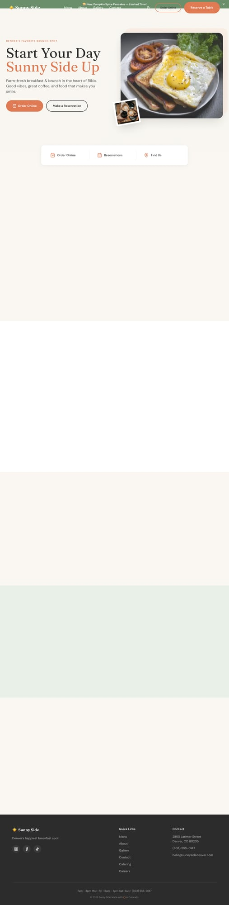

# Brunch Starter 🍳☀️

A warm, inviting Next.js template designed for brunch cafes, breakfast spots, and casual dining restaurants. Built with modern web technologies and a cozy aesthetic that makes your guests hungry just looking at it.



## ✨ Features

### Pages
- **Homepage** - Warm hero section, quick actions, menu highlights, location info, Instagram feed, newsletter signup
- **Menu** - Categorized menu with dietary labels (V/VG/GF), featured items with images, pricing
- **About** - Team bios, brand story, values, local partners, company timeline
- **Gallery** - Filterable photo gallery with lightbox viewer
- **Contact** - Location map, hours, reservation section, contact form, FAQ

### Design & UX
- 🌗 **Dark/Light Mode** - Seamless theme switching with localStorage persistence
- 📱 **Fully Responsive** - Mobile-first design that looks great on all devices
- ✨ **Smooth Animations** - Framer Motion page transitions and scroll animations
- 🎨 **Warm Color Palette** - Coral, sage, peach, and cream create an inviting atmosphere
- 🖋️ **Beautiful Typography** - Fraunces display + DM Sans body fonts

### Technical
- ⚡ **Next.js 14** - App Router, React Server Components
- 🎨 **Tailwind CSS** - Utility-first styling with custom design tokens
- 🔄 **Framer Motion** - Smooth animations and page transitions
- 📊 **Schema.org** - Restaurant structured data for rich search results
- ♿ **Accessible** - WCAG compliant with skip links, ARIA labels, keyboard navigation
- 🔍 **SEO Ready** - Open Graph tags, meta descriptions, semantic HTML

## 🚀 Quick Start

```bash
# Clone the template
npx create-next-app@latest my-restaurant --example https://github.com/your-repo/brunch-starter

# Or if you have the template locally
cd brunch-starter
npm install
npm run dev
```

Open [http://localhost:3000](http://localhost:3000) to see your site.

## 📁 Project Structure

```
brunch-starter/
├── app/
│   ├── _components/         # Shared components (Nav, Footer)
│   ├── about/page.tsx       # About page
│   ├── contact/page.tsx     # Contact page with form
│   ├── gallery/page.tsx     # Photo gallery
│   ├── menu/page.tsx        # Restaurant menu
│   ├── page.tsx             # Homepage
│   ├── layout.tsx           # Root layout with fonts & meta
│   └── globals.css          # Global styles & Tailwind
├── components/
│   └── shared/              # Reusable section components
├── lib/
│   └── lenis.tsx            # Smooth scroll provider
├── public/                  # Static assets
└── screenshots/             # Template preview images
```

## 🎨 Customization

### Brand Colors
Edit `tailwind.config.ts` to update the color palette:

```js
colors: {
  coral: '#E07A5F',      // Primary accent
  sage: '#81B29A',       // Secondary accent  
  peach: '#FFE5D9',      // Warm background
  cream: '#FAF7F2',      // Light background
  charcoal: '#2D2926',   // Text color
  sunny: '#F2CC8F',      // Highlight color
}
```

### Restaurant Info
Update site content in each page file. Key data objects:
- `siteConfig` in `page.tsx` - Name, tagline, contact info, hours
- `MENU_ITEMS` in `menu/page.tsx` - Full menu with prices
- `TEAM` in `about/page.tsx` - Staff bios and photos
- `RESTAURANT` in `contact/page.tsx` - Location details

### Fonts
The template uses Google Fonts loaded via `next/font`:
- **Fraunces** - Display headings (warm, friendly serif)
- **DM Sans** - Body text (clean, readable)
- **Caveat** - Script accents (handwritten feel)

Swap fonts in `app/layout.tsx`:
```tsx
const fraunces = Fraunces({ subsets: ['latin'], variable: '--font-display' })
```

### Images
Replace Unsplash placeholder images with your own:
1. Add images to `/public` folder
2. Update image `src` props in components
3. Recommended sizes:
   - Hero: 600x500px
   - Menu items: 400x300px
   - Team photos: 300x300px (square)
   - Gallery: 800x600px

## 🔧 Configuration

### Meta Tags
Update SEO metadata in `app/layout.tsx`:
```tsx
export const metadata: Metadata = {
  title: 'Your Restaurant | Tagline',
  description: 'Your restaurant description...',
  openGraph: { ... },
  twitter: { ... },
}
```

### Structured Data
The homepage includes Restaurant schema for rich search results. Update the `StructuredData` component with your actual business info:
- Name, description, phone, email
- Address coordinates
- Opening hours
- Social media links

### Contact Form
The contact form uses client-side state. To add real submission:
1. Create an API route in `app/api/contact/route.ts`
2. Connect to your email service (Resend, SendGrid, etc.)
3. Update the `handleSubmit` function in `contact/page.tsx`

## 📦 Deployment

### Vercel (Recommended)
```bash
npm install -g vercel
vercel
```

### Docker
```dockerfile
FROM node:20-alpine
WORKDIR /app
COPY . .
RUN npm ci && npm run build
CMD ["npm", "start"]
```

### Static Export
```bash
# Add to next.config.js: output: 'export'
npm run build
# Deploy the 'out' folder to any static host
```

## 🤝 Contributing

Contributions welcome! Please read our contributing guidelines and submit PRs for any improvements.

## 📄 License

MIT License - feel free to use this template for personal or commercial projects.

---

Built with ☕ and ☀️ for restaurants who believe breakfast should make you smile.
