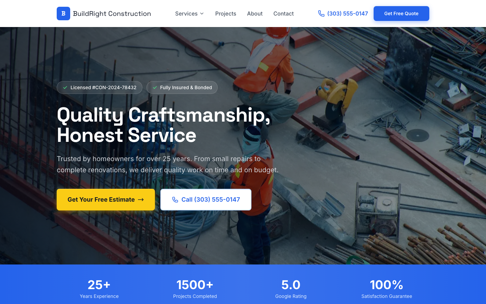

# Contractor Starter Template

A professional, conversion-focused website template for contractors, home remodelers, construction companies, and trade professionals. Built with Next.js 14, Tailwind CSS, and Framer Motion.



## ✨ Features

### Lead Generation
- **Quote Request Form** - Comprehensive intake with service selection, project details, and file upload
- **Click-to-Call** - Mobile-optimized phone CTAs throughout
- **24/7 Emergency Contact** - Highlighted emergency service availability
- **Multiple CTAs** - Strategic placement on every page

### Trust Building
- **License & Insurance Badges** - Prominent display of credentials
- **Customer Testimonials** - 5-star reviews with locations and project types
- **Team Profiles** - Put faces to your company
- **Stats Bar** - Years in business, projects completed, ratings
- **Credentials Section** - BBB rating, certifications, memberships

### Service Showcase
- **Service Pages** - Individual pages for each service with:
  - Detailed descriptions and feature lists
  - What's included breakdown
  - Step-by-step process timeline
  - Price range indicators
  - Service-specific FAQs
  - Photo gallery
- **Services Grid** - Visual overview with icons and quick links

### Portfolio
- **Project Gallery** - Filterable by category
- **Project Detail Pages** - Before/after images, scope, testimonials
- **Category Tags** - Kitchen, Bathroom, Basement, Outdoor, etc.

### Content
- **FAQ Accordion** - Animated, accessible accordion component
- **Service Areas** - City chips with coverage map placeholder
- **About Page** - Company story, values, team, credentials

### Technical
- **Next.js 14** - App Router, server components, optimized builds
- **Tailwind CSS** - Custom design system with CSS variables
- **Framer Motion** - Smooth scroll animations and transitions
- **Lenis** - Buttery smooth scrolling
- **TypeScript** - Full type safety
- **Mobile-First** - Responsive design with mobile CTA bar
- **SEO Ready** - Meta tags, Open Graph, semantic HTML
- **Accessibility** - ARIA labels, keyboard navigation, skip links

## 🚀 Quick Start

```bash
# Install dependencies
npm install

# Start development server
npm run dev

# Build for production
npm run build

# Start production server
npm start
```

Open [http://localhost:3000](http://localhost:3000) to view the site.

## 📁 Project Structure

```
├── app/
│   ├── layout.tsx          # Root layout with fonts and metadata
│   ├── page.tsx            # Homepage
│   ├── globals.css         # Global styles and design tokens
│   ├── about/page.tsx      # About page
│   ├── contact/page.tsx    # Contact page with quote form
│   ├── projects/
│   │   ├── page.tsx        # Projects gallery
│   │   └── [slug]/page.tsx # Individual project pages
│   └── services/
│       ├── page.tsx        # All services page
│       └── [slug]/page.tsx # Individual service pages
├── components/
│   ├── layout/             # Nav, Footer, MobileCTA
│   ├── sections/           # Reusable page sections
│   ├── cards/              # Service, Project, Team cards
│   └── forms/              # QuoteForm component
├── lib/
│   └── data.ts             # ⚡ All content lives here
└── public/
    └── screenshots/        # Template preview images
```

## ⚙️ Customization

### 1. Company Information
Edit `lib/data.ts` to update:

```typescript
export const COMPANY = {
  name: "Your Company Name",
  tagline: "Your Tagline Here",
  phone: "(555) 123-4567",
  email: "info@yourcompany.com",
  address: { street, city, state, zip },
  license: "License #YOUR-LICENSE",
  yearsInBusiness: 25,
  projectsCompleted: 1500,
  // ...
}
```

### 2. Services
Add, remove, or modify services in the `SERVICES` array:

```typescript
export const SERVICES = [
  {
    icon: "🏠",
    name: "Kitchen Remodeling",
    slug: "kitchen-remodeling",
    shortDescription: "...",
    features: ["Custom Cabinets", "Countertops", ...],
    // Full service details
  },
  // Add more services...
]
```

### 3. Projects/Portfolio
Update the `PROJECTS` array with your completed work:

```typescript
export const PROJECTS = [
  {
    title: "Modern Kitchen Remodel",
    slug: "modern-kitchen-denver",
    category: "Kitchen",
    image: "https://...",
    location: "Denver, CO",
    // Project details
  },
]
```

### 4. Testimonials
Replace with real customer reviews:

```typescript
export const TESTIMONIALS = [
  {
    quote: "Actual customer review...",
    author: "Customer Name",
    location: "City, State",
    rating: 5,
    project: "Kitchen Remodel"
  },
]
```

### 5. Styling
Customize colors in `tailwind.config.js`:

```javascript
colors: {
  primary: {
    500: '#2563eb', // Your brand blue
    600: '#1d4ed8',
    // ...
  },
  accent: {
    400: '#fbbf24', // CTA yellow
  },
}
```

Or modify CSS variables in `app/globals.css`:

```css
:root {
  --primary: 37 99 235;
  --accent: 251 191 36;
  --background: 255 255 255;
  /* ... */
}
```

## 🔌 Integrations

### Form Handling
The `QuoteForm` component is ready for integration with:

- **Formspree** - Add your form ID
- **Netlify Forms** - Add `data-netlify="true"`
- **Custom API** - Modify the submit handler

### Maps
Replace the map placeholder in `contact/page.tsx`:

```tsx
<iframe 
  src="https://www.google.com/maps/embed?pb=..."
  className="w-full h-full"
  loading="lazy"
/>
```

### Analytics
Add to `app/layout.tsx`:

```tsx
<Script src="https://www.googletagmanager.com/gtag/js?id=GA_ID" />
```

### Scheduling
Embed Calendly for consultations:

```tsx
<div className="calendly-inline-widget" data-url="https://calendly.com/your-link" />
```

## 📱 Responsive Design

- **Desktop** (1440px+): Full navigation, side-by-side layouts
- **Tablet** (768px-1439px): Adapted grid layouts
- **Mobile** (<768px): 
  - Hamburger menu
  - Stacked content
  - Fixed bottom CTA bar
  - Click-to-call prominence

## 🔍 SEO

Pre-configured with:
- Dynamic meta titles and descriptions
- Open Graph tags for social sharing
- Twitter Card support
- Semantic HTML structure
- robots.txt ready

Update metadata in `app/layout.tsx`:

```typescript
export const metadata: Metadata = {
  title: 'Your Company | Service Area Contractor',
  description: 'Your SEO description...',
  // ...
}
```

## 📦 Deployment

### Vercel (Recommended)
```bash
npm run build
vercel deploy
```

### Netlify
```bash
npm run build
# Deploy .next folder
```

### Docker
```dockerfile
FROM node:18-alpine
WORKDIR /app
COPY . .
RUN npm install && npm run build
CMD ["npm", "start"]
```

## 🎨 Design Tokens

| Token | Usage |
|-------|-------|
| `--primary` | Brand color, links, buttons |
| `--accent` | CTAs, highlights |
| `--background` | Page backgrounds |
| `--foreground` | Primary text |
| `--muted` | Secondary backgrounds |
| `--muted-foreground` | Secondary text |

## 📄 License

MIT License - feel free to use for personal or commercial projects.

## 🤝 Support

Need help customizing this template? [Contact us](mailto:support@example.com)

---

Built with ❤️ for contractors who do great work.
