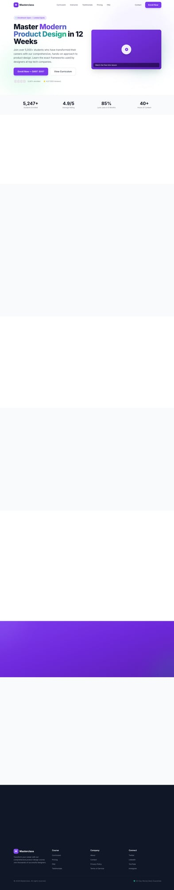

# Course Starter Template

A premium, conversion-focused online course landing page template built with Next.js 14, TypeScript, Tailwind CSS, and Framer Motion. Perfect for course creators, educators, and coaches who want a professional, high-converting platform to sell their knowledge.



## ✨ Features

### Design & UX
- **Modern, Premium Aesthetic** - Clean gradients, smooth shadows, and professional typography
- **Conversion-Optimized Layout** - Strategic CTA placement, trust indicators, and social proof sections
- **Smooth Animations** - Scroll-triggered reveals and micro-interactions with Framer Motion
- **Fully Responsive** - Pixel-perfect on mobile, tablet, and desktop

### Pages Included
| Page | Route | Description |
|------|-------|-------------|
| Home | `/` | Hero section, features, curriculum preview, testimonials, FAQ, and CTAs |
| Curriculum | `/curriculum` | Full course outline with expandable modules and lesson breakdown |
| Instructor | `/about` | Instructor bio, credentials, story, and media features |
| Testimonials | `/testimonials` | Student success stories, video testimonials, and transformations |
| Pricing | `/pricing` | 3-tier pricing with comparison table and payment options |
| FAQ | `/faq` | Categorized frequently asked questions |
| Contact | `/contact` | Contact form with info and social links |

### Components
- `Navbar` - Sticky navigation with scroll effects and mobile hamburger menu
- `Footer` - Full footer with links, social icons, and trust badges
- `CourseModuleCard` - Expandable accordion for curriculum modules
- `TestimonialCard` - Student testimonial with quote, rating, and results
- `PricingCard` - Pricing tier with features, popular badge, and CTA
- `InstructorCard` - Instructor profile with credentials
- `FAQAccordion` - Collapsible FAQ with category filtering
- `CTASection` - Flexible call-to-action with multiple variants

## 🚀 Quick Start

```bash
# Install dependencies
npm install

# Start development server
npm run dev

# Build for production
npm run build

# Start production server
npm start
```

Open [http://localhost:3000](http://localhost:3000) to view the template.

## 🎨 Customization

### Brand Colors

Edit `tailwind.config.ts` to customize your brand palette:

```ts
colors: {
  primary: {
    50: "#faf5ff",
    100: "#f3e8ff",
    500: "#8b5cf6",  // Main purple
    600: "#7c3aed",
    700: "#6d28d9",
    // ...
  },
  accent: {
    500: "#10b981",  // Teal/green for highlights
    600: "#059669",
    // ...
  },
}
```

### Course Content

All content is centralized in `/src/data/mockData.ts`:

```ts
// Course info
export const courseInfo = {
  title: "Master Modern Product Design",
  price: 497,
  originalPrice: 997,
  studentsEnrolled: 5247,
  rating: 4.9,
  // ...
};

// Pricing tiers ($197, $497, $997)
export const pricingTiers = [
  { id: "basic", name: "Essential", price: 197, ... },
  { id: "pro", name: "Professional", price: 497, ... },
  { id: "vip", name: "VIP Mentorship", price: 997, ... },
];

// Curriculum modules
export const modules = [...];

// Instructor details
export const instructor = {...};

// Student testimonials
export const testimonials = [...];

// FAQs
export const faqs = [...];
```

### Images

Replace placeholder images in `/public`:
- `/instructor.jpg` - Instructor headshot (recommended: 800x1000px)
- `/testimonials/*.jpg` - Student photos (recommended: 200x200px)

## 📁 Project Structure

```
course-starter/
├── src/
│   ├── app/
│   │   ├── page.tsx          # Home page
│   │   ├── layout.tsx        # Root layout with Navbar/Footer
│   │   ├── curriculum/       # Curriculum page
│   │   ├── about/            # Instructor page
│   │   ├── testimonials/     # Testimonials page
│   │   ├── pricing/          # Pricing page
│   │   ├── faq/              # FAQ page
│   │   └── contact/          # Contact page
│   ├── components/
│   │   ├── Navbar.tsx
│   │   ├── Footer.tsx
│   │   ├── CourseModuleCard.tsx
│   │   ├── TestimonialCard.tsx
│   │   ├── PricingCard.tsx
│   │   ├── InstructorCard.tsx
│   │   ├── FAQAccordion.tsx
│   │   └── CTASection.tsx
│   └── data/
│       └── mockData.ts       # All course content
├── public/
│   └── (images)
├── screenshots/
│   ├── og-image.png          # Open Graph image (1200x630)
│   ├── preview-desktop.png   # Desktop preview (1440x900)
│   └── preview-mobile.png    # Mobile preview (375x812)
├── tailwind.config.ts
└── package.json
```

## 🛠️ Tech Stack

- **Framework**: [Next.js 14](https://nextjs.org/) (App Router)
- **Language**: [TypeScript](https://www.typescriptlang.org/)
- **Styling**: [Tailwind CSS](https://tailwindcss.com/)
- **Animations**: [Framer Motion](https://www.framer.com/motion/)
- **Font**: Inter (Google Fonts)

## 💡 Best Practices Included

- ✅ Static site generation (SSG) for fast page loads
- ✅ SEO-friendly structure with proper heading hierarchy
- ✅ Accessible components with ARIA labels
- ✅ Mobile-first responsive design
- ✅ Optimized images with Next.js Image component
- ✅ Clean, maintainable code structure

## 📸 Screenshots

### Desktop View


### Mobile View


## 📄 License

MIT — Free for personal and commercial use.

---

Built with ❤️ for course creators who want to focus on teaching, not web development.
