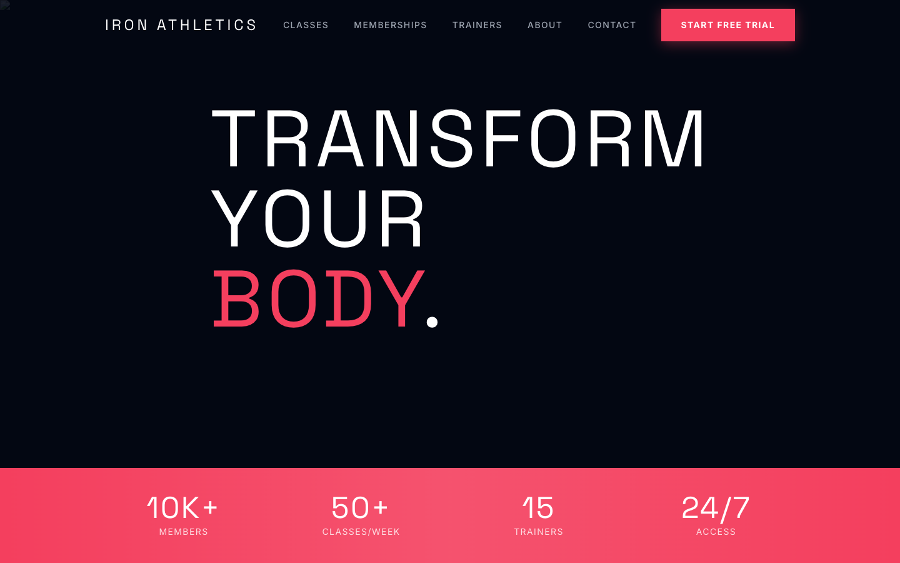

# Gym Starter Template

A bold, high-energy Next.js template designed for gyms, fitness studios, and boutique fitness businesses. Features a dark aesthetic with vibrant accent colors, powerful animations, and everything you need to convert visitors into members.



## ✨ Features

### Core Functionality
- **Class Scheduling** - Interactive weekly schedule with filtering by class type and day
- **Membership Tiers** - Day pass, monthly, and annual plans with feature comparison
- **Trainer Profiles** - Individual trainer pages with bios, certifications, and schedules
- **Contact Form** - Client-ready form with validation
- **Blog Section** - Content marketing ready with categories and author attribution

### Design & UX
- **Dark Theme** - Premium dark aesthetic with vibrant coral/red accents
- **Bold Typography** - Space Grotesk display font with aggressive styling
- **Smooth Animations** - GSAP-powered animations with Framer Motion
- **Responsive Design** - Optimized for all device sizes
- **Accessibility** - Skip links, proper ARIA labels, reduced motion support

### Technical
- **Next.js 14** - App Router with React Server Components
- **TypeScript** - Full type safety throughout
- **Tailwind CSS** - Utility-first styling with custom design system
- **Lenis** - Smooth scrolling experience
- **GSAP + SplitText** - Premium text animations

## 🚀 Quick Start

```bash
# Install dependencies
npm install

# Start development server
npm run dev

# Build for production
npm run build

# Start production server
npm start
```

## 📁 Project Structure

```
app/
├── components/      # Shared UI components
│   ├── data.tsx     # All site content & data
│   ├── types.ts     # TypeScript interfaces
│   ├── Nav.tsx      # Navigation
│   ├── Hero.tsx     # Hero section
│   ├── Classes.tsx  # Class cards
│   └── ...
├── classes/         # Classes page
├── memberships/     # Membership & pricing
├── trainers/        # Trainer profiles
├── about/           # About page
├── contact/         # Contact page
├── blog/            # Blog listing
└── page.tsx         # Homepage
```

## 🎨 Customization

### Brand & Content
Edit `app/components/data.tsx` to customize:
- Gym name, contact info, hours
- Classes and schedule
- Membership plans and pricing
- Trainer profiles
- Amenities
- Blog posts

### Colors
Update `tailwind.config.ts` to change the color scheme:
```ts
colors: {
  primary: {
    500: '#F43F5E', // Accent color
  },
  dark: {
    950: '#0A0A0A', // Background
    900: '#121212',
    800: '#1F1F1F',
  }
}
```

### Fonts
Fonts are configured in `app/layout.tsx`:
- Display: Space Grotesk (headlines)
- Body: Inter (body text)

### Images
Replace placeholder images in `data.tsx` with your own. Recommended sources:
- [Unsplash](https://unsplash.com) - Free high-quality photos
- Professional gym photography

## 🔧 Configuration

### Environment Variables
Create a `.env.local` file for:
```env
# Optional: Sanity CMS
NEXT_PUBLIC_SANITY_PROJECT_ID=
NEXT_PUBLIC_SANITY_DATASET=

# Optional: Google Maps
NEXT_PUBLIC_GOOGLE_MAPS_API_KEY=
```

### CMS Integration
This template is Sanity-ready. To enable CMS:
1. Create a Sanity project
2. Add credentials to `.env.local`
3. Define schemas matching the data types

## 📱 Pages

| Page | Route | Description |
|------|-------|-------------|
| Home | `/` | Hero, classes preview, pricing, trainers |
| Classes | `/classes` | Full schedule with filters |
| Memberships | `/memberships` | Pricing tiers, comparison, FAQs |
| Trainers | `/trainers` | All trainers with full profiles |
| About | `/about` | Story, values, facilities, equipment |
| Contact | `/contact` | Form, info, map placeholder |
| Blog | `/blog` | Articles by category |

## 🎭 Animations

The template uses a hybrid animation approach:
- **GSAP + SplitText** - Headline text reveals
- **Framer Motion** - Scroll-triggered section animations
- **CSS Transitions** - Hover states and micro-interactions
- **Lenis** - Smooth page scrolling

All animations respect `prefers-reduced-motion` for accessibility.

## 📸 Screenshots

Required for marketplace submission:
- `og-image.png` (1200×630) - Social sharing
- `preview-desktop.png` (1440×900) - Desktop preview
- `preview-mobile.png` (375×812) - Mobile preview

## 🚢 Deployment

### Vercel (Recommended)
```bash
npm i -g vercel
vercel
```

### Netlify
```bash
npm run build
# Deploy .next folder
```

### Docker
```dockerfile
FROM node:18-alpine
WORKDIR /app
COPY package*.json ./
RUN npm ci
COPY . .
RUN npm run build
CMD ["npm", "start"]
```

## 📄 License

MIT License - Use freely for personal and commercial projects.

---

Built with ❤️ for the fitness community.
