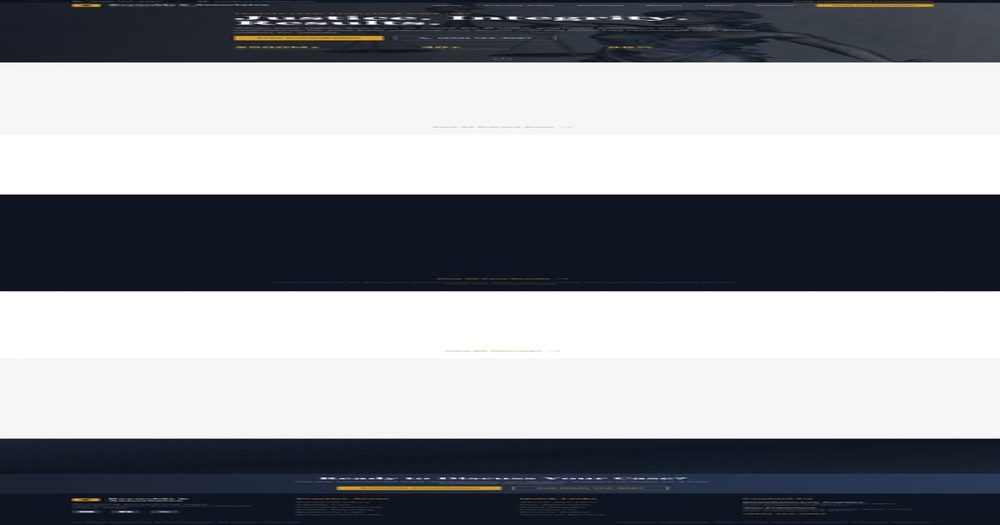

# Law Firm Starter Template

A professional, conversion-optimized website template designed for law firms and legal practices. Built with Next.js 14, Tailwind CSS, and Framer Motion.


## ✨ Features

- **Modern Design** - Professional navy/gold color scheme conveying trust and authority
- **Fully Responsive** - Optimized for desktop, tablet, and mobile devices
- **Performance Optimized** - Built on Next.js 14 with App Router
- **SEO Ready** - Proper meta tags, semantic HTML, and optimized structure
- **Animated** - Smooth scroll animations powered by Framer Motion
- **Type Safe** - Full TypeScript implementation

## 📄 Pages Included

| Page | Description |
|------|-------------|
| **Home** | Hero section, practice areas, case results, testimonials, attorney highlights |
| **Practice Areas** | Grid of all practice areas with detailed individual pages |
| **Attorneys** | Team directory with individual attorney profile pages |
| **Results** | Case results and verdicts showcase with disclaimers |
| **About** | Firm history, values, community involvement, awards |
| **Contact** | Contact form, office locations, FAQ section |

## 🏗️ Tech Stack

- **Framework**: Next.js 14 (App Router)
- **Styling**: Tailwind CSS
- **Animations**: Framer Motion
- **Language**: TypeScript
- **Images**: Next/Image with Unsplash

## 🚀 Quick Start

```bash
# Install dependencies
npm install

# Run development server
npm run dev

# Build for production
npm run build

# Start production server
npm start
```

## 📁 Project Structure

```
src/
├── app/
│   ├── about/page.tsx
│   ├── attorneys/
│   │   ├── [slug]/page.tsx
│   │   └── page.tsx
│   ├── contact/page.tsx
│   ├── practice-areas/
│   │   ├── [slug]/page.tsx
│   │   └── page.tsx
│   ├── results/page.tsx
│   ├── layout.tsx
│   ├── page.tsx
│   └── globals.css
├── components/
│   ├── AttorneyCard.tsx
│   ├── CaseResultCard.tsx
│   ├── ContactForm.tsx
│   ├── Footer.tsx
│   ├── Navbar.tsx
│   ├── PageHero.tsx
│   ├── PracticeAreaCard.tsx
│   ├── SectionHeading.tsx
│   └── TestimonialCard.tsx
└── data/
    └── mockData.ts
```

## 🎨 Customization

### Colors

The template uses a custom color palette defined in `tailwind.config.ts`:

- **Navy** - Primary brand color (dark blues)
- **Gold** - Accent color for CTAs and highlights
- **Charcoal** - Text and neutral tones

### Content

All content is centralized in `src/data/mockData.ts`:

- **Firm Info** - Name, tagline, founded date, mission, values
- **Attorneys** - Team members with bios, credentials, photos
- **Practice Areas** - Services with descriptions, FAQs, case types
- **Case Results** - Verdicts and settlements with proper disclaimers
- **Testimonials** - Client reviews with ratings
- **Office Locations** - Contact info and addresses

### Images

Images are sourced from Unsplash. To use your own:

1. Replace URLs in `mockData.ts`
2. Update `next.config.mjs` with your image domains

## 📱 Responsive Design

- **Mobile** (< 640px): Single column, hamburger menu
- **Tablet** (640px - 1024px): Two column grids
- **Desktop** (> 1024px): Full multi-column layouts

## ⚖️ Legal Compliance

This template includes:

- Attorney advertising disclaimer in footer
- "Past results do not guarantee future outcomes" notices
- Privacy/confidentiality messaging
- Proper legal disclaimers on case results

## 📸 Screenshots

### Desktop


### Mobile


### Social Share


## 📝 License

MIT License - Free for personal and commercial use.

## 🤝 Support

For questions or customization requests, please open an issue.

---

Built with ❤️ for the legal profession
