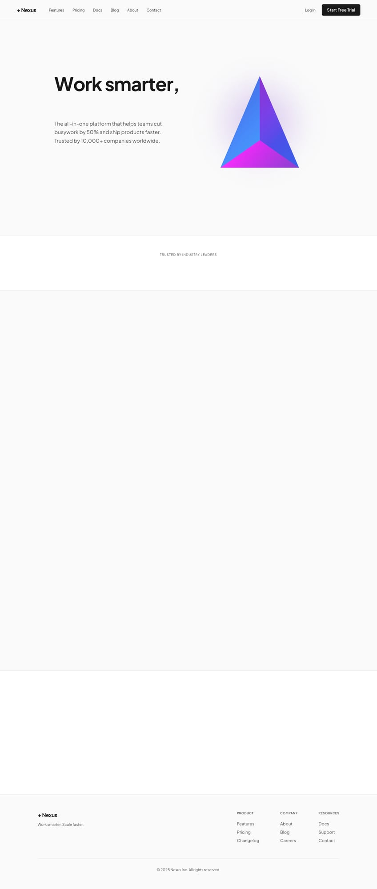

# Minimal Starter

A clean, modern SaaS landing page template with premium GSAP animations and smooth scrolling.



## ✨ Features

- **Premium Animations** — GSAP-powered text reveals, scroll-triggered effects, and parallax
- **Smooth Scrolling** — Lenis integration for buttery-smooth scroll experience
- **Dark Mode** — Automatic system preference detection with seamless light/dark theming
- **Responsive Design** — Mobile-first approach with adaptive layouts
- **Accessible** — Skip links, WCAG AA color contrast, proper ARIA attributes, focus management
- **SEO Ready** — Complete meta tags, OpenGraph, and Twitter Card support
- **Type Safe** — Full TypeScript implementation

## 🚀 Quick Start

### Prerequisites

- Node.js 18+
- npm, yarn, or pnpm

### Installation

```bash
# Clone or copy the template
cd minimal-starter

# Install dependencies
npm install

# Start development server
npm run dev
```

Open [http://localhost:3000](http://localhost:3000) to see your site.

### Environment Variables

**None required** — This template works out of the box with no environment configuration needed.

## 📁 Project Structure

```
minimal-starter/
├── app/                    # Next.js App Router pages
│   ├── page.tsx           # Homepage with hero, bento grid, features
│   ├── layout.tsx         # Root layout with fonts, metadata, smooth scroll
│   ├── globals.css        # Global styles and CSS utilities
│   ├── about/             # Company about page
│   ├── blog/              # Blog listing page
│   ├── contact/           # Contact form page
│   ├── docs/              # Documentation page
│   ├── features/          # Features showcase page
│   └── pricing/           # Pricing tiers page
├── components/            # Reusable UI components
│   ├── Nav.tsx           # Responsive navigation with mobile menu
│   ├── Footer.tsx        # Site footer
│   ├── PageHeader.tsx    # Reusable page header with animations
│   └── CTA.tsx           # Call-to-action section
├── lib/                   # Utilities and configurations
│   ├── gsap.ts           # GSAP setup with ScrollTrigger, SplitText
│   └── lenis.tsx         # Lenis smooth scroll provider
├── hooks/                 # Custom React hooks
├── public/               # Static assets
└── screenshots/          # Preview images
```

## 🎨 Customization

### Colors

Edit `tailwind.config.js` to customize the color palette:

```js
colors: {
  minimal: {
    bg: '#fafafa',        // Light background
    text: '#171717',      // Primary text
    muted: '#525252',     // Secondary text
    border: '#e5e5e5',    // Borders
    accent: '#0070f3',    // Primary accent (blue)
    dark: {               // Dark mode variants
      bg: '#0a0a0a',
      text: '#fafafa',
      // ...
    },
    // Gradient colors for visual elements
    gradientPink: '#ff0080',
    gradientPurple: '#7928ca',
    gradientBlue: '#0070f3',
    gradientCyan: '#00d4ff',
  },
}
```

### Fonts

The template uses **Plus Jakarta Sans** from Google Fonts. To change:

1. Update the import in `app/layout.tsx`:
   ```tsx
   import { Your_Font } from 'next/font/google'
   ```

2. Update the CSS variable name and `tailwind.config.js` fontFamily settings

### Content

| What to Edit | Where |
|-------------|-------|
| Site name & branding | `app/layout.tsx` (metadata), `components/Nav.tsx` |
| Homepage content | `app/page.tsx` (hero text, features, logos) |
| Page content | Each `app/[page]/page.tsx` file |
| Navigation links | `components/Nav.tsx` (navLinks array) |
| Footer links | `components/Footer.tsx` |

## 📄 Pages

| Route | Description |
|-------|-------------|
| `/` | Homepage with hero, logo bar, bento stats grid, features section |
| `/features` | Detailed feature showcases with animated visuals |
| `/pricing` | Three-tier pricing with comparison table and FAQs |
| `/about` | Company story, values, team members, and careers |
| `/blog` | Blog listing page (ready for content) |
| `/docs` | Documentation page (ready for content) |
| `/contact` | Contact form with office locations |

## 🚀 Deployment

### Vercel (Recommended)

1. Push your code to GitHub/GitLab/Bitbucket
2. Import the project at [vercel.com/new](https://vercel.com/new)
3. Vercel auto-detects Next.js — just click Deploy
4. Your site is live with automatic HTTPS and global CDN

### Other Platforms

**Netlify:**
```bash
npm run build
# Deploy the `.next` folder or use Netlify's Next.js plugin
```

**Self-hosted:**
```bash
npm run build
npm run start
```

## 🛠 Tech Stack

| Technology | Purpose |
|------------|---------|
| [Next.js 14](https://nextjs.org/) | React framework with App Router |
| [React 18](https://react.dev/) | UI library |
| [TypeScript](https://www.typescriptlang.org/) | Type safety |
| [Tailwind CSS](https://tailwindcss.com/) | Utility-first styling |
| [GSAP](https://gsap.com/) | Premium animations |
| [Lenis](https://lenis.darkroom.engineering/) | Smooth scrolling |
| [Framer Motion](https://www.framer.com/motion/) | React animations |
| [Lucide React](https://lucide.dev/) | Icon library |

## 📝 License

MIT
