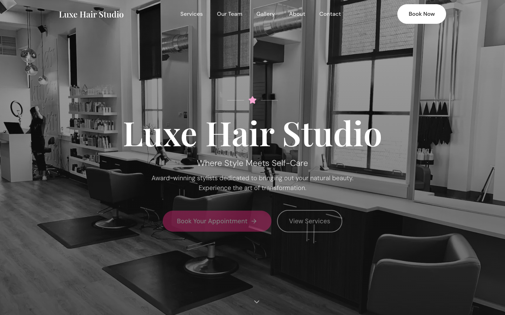

# Luxe Hair Studio - Salon & Spa Website Template

A premium, elegant website template designed for hair salons, beauty studios, spas, and wellness businesses. Features a sophisticated feminine aesthetic with smooth animations, booking integration, and a full suite of professional pages.



## ✨ Features

### Design & UX
- **Premium Feminine Aesthetic** - Elegant typography with Playfair Display + DM Sans pairing
- **Smooth Animations** - Powered by Framer Motion for polished transitions and scroll effects
- **Lenis Smooth Scrolling** - Butter-smooth scroll experience
- **Responsive Design** - Optimized for all devices from mobile to desktop
- **Dark Mode Ready** - CSS variables configured for easy theme switching
- **Accessibility First** - WCAG compliant with proper ARIA labels, focus management, and skip links

### Pages Included
| Page | Description |
|------|-------------|
| **Home** | Hero with parallax, services menu, team preview, gallery, testimonials, booking CTA |
| **Services** | Filterable service categories with pricing, descriptions, and durations |
| **Team** | Individual stylist profiles with bios, specialties, and Instagram links |
| **Gallery** | Filterable portfolio with lightbox, category tabs, and Instagram integration |
| **About** | Brand story, values, salon tour gallery, press mentions |
| **Contact** | Contact info, embedded map, form with topic selector |
| **Book** | Embedded booking widget + fallback request form with policies |

### Components
- **Transparent Header** - Transforms on scroll, mobile-optimized with focus trap
- **Page Hero** - Reusable hero with optional background image and parallax
- **Service Menu** - Tabbed pricing tables with category icons
- **Team Cards** - Stylist profiles with hover effects
- **Gallery Grid** - Masonry-style with lightbox viewer
- **Testimonials** - Star ratings with animated entrance
- **Contact Form** - Topic selector with validation states
- **Booking Widget** - Supports Fresha, Acuity, Calendly, Square embeds
- **Map Embed** - Google Maps integration with styled placeholder

### Technical
- **Next.js 14** - App Router with Server Components
- **TypeScript** - Full type safety
- **Tailwind CSS** - Utility-first styling with custom design tokens
- **Framer Motion** - Production-ready animations
- **Lenis** - Smooth scroll library
- **Lucide Icons** - Beautiful, consistent iconography

## 🚀 Quick Start

### Prerequisites
- Node.js 18+ 
- npm, yarn, or pnpm

### Installation

```bash
# Clone or download the template
git clone [your-repo]

# Navigate to template directory
cd salon-starter

# Install dependencies
npm install

# Start development server
npm run dev
```

Open [http://localhost:3000](http://localhost:3000) to see the result.

## 📁 Project Structure

```
salon-starter/
├── app/
│   ├── about/page.tsx       # About page
│   ├── book/page.tsx        # Booking page
│   ├── contact/page.tsx     # Contact page
│   ├── gallery/page.tsx     # Gallery page
│   ├── services/page.tsx    # Services page
│   ├── team/page.tsx        # Team page
│   ├── globals.css          # Global styles & design tokens
│   ├── layout.tsx           # Root layout with fonts & metadata
│   └── page.tsx             # Homepage
├── components/
│   ├── layout/
│   │   ├── Nav.tsx          # Header/navigation
│   │   ├── Footer.tsx       # Footer
│   │   └── index.ts         # Exports
│   ├── shared/
│   │   ├── PageHero.tsx     # Reusable page hero
│   │   ├── Breadcrumbs.tsx  # Breadcrumb navigation
│   │   ├── ContactForm.tsx  # Contact form component
│   │   ├── MapEmbed.tsx     # Google Maps embed
│   │   ├── Lightbox.tsx     # Image lightbox viewer
│   │   └── index.ts         # Exports
│   ├── BookingButton.tsx    # Booking widget embed
│   └── PaymentEmbed.tsx     # Payment integration
├── lib/
│   └── lenis.tsx            # Smooth scroll provider
├── public/                  # Static assets
├── screenshots/             # Template preview images
└── package.json
```

## 🎨 Customization

### Brand Colors

Edit the CSS variables in `app/globals.css`:

```css
:root {
  /* Primary - Your brand color */
  --primary-50: 253 242 248;
  --primary-500: 236 72 153;  /* Pink - change to your color */
  --primary-600: 219 39 119;
  --primary-700: 190 24 93;
  
  /* Neutrals */
  --background: 255 255 255;
  --foreground: 23 23 23;
  --muted: 250 250 250;
  --border: 229 229 229;
}
```

### Typography

Fonts are configured in `app/layout.tsx`:

```tsx
import { DM_Sans, Playfair_Display } from 'next/font/google'

const playfair = Playfair_Display({ subsets: ['latin'], variable: '--font-display' })
const dmSans = DM_Sans({ subsets: ['latin'], variable: '--font-body' })
```

### Business Information

Update the `SALON` constant in each page to match your business:

```tsx
const SALON = {
  name: "Your Salon Name",
  tagline: "Your Tagline Here",
  phone: "(555) 123-4567",
  email: "hello@yoursalon.com",
  address: "123 Main Street, City, ST 12345",
  // ...
}
```

### Services & Pricing

Edit the `SERVICES` array in `app/page.tsx` and `app/services/page.tsx`:

```tsx
const SERVICES = [
  {
    category: "Hair Cuts",
    items: [
      { name: "Women's Cut & Style", price: 65, duration: "60 min" },
      // Add your services...
    ]
  },
  // Add categories...
]
```

### Team Members

Update the `STYLISTS` array in `app/page.tsx` and `app/team/page.tsx`:

```tsx
const STYLISTS = [
  { 
    name: "Jane Doe", 
    role: "Master Stylist", 
    specialty: ["Balayage", "Color"],
    image: "/images/team/jane.jpg",
    bio: "Your stylist bio...",
    instagram: "@jane_hair"
  },
  // Add team members...
]
```

### Booking Integration

Configure your booking provider in `app/book/page.tsx`:

```tsx
const bookingConfig = {
  enabled: true,
  provider: 'fresha', // 'fresha' | 'acuity' | 'calendly' | 'square'
  embedUrl: 'https://widget.fresha.com/your-salon',
  buttonText: 'Book Now',
}
```

Supported providers:
- **Fresha** - `https://widget.fresha.com/your-id`
- **Acuity** - `https://app.acuityscheduling.com/schedule.php?owner=YOUR_ID`
- **Calendly** - `https://calendly.com/your-name`
- **Square Appointments** - `https://squareup.com/appointments/book/your-id`

### Google Maps

Update the map in `components/shared/MapEmbed.tsx` with your Google Maps embed URL or API key.

## 🖼️ Images

Replace placeholder images with your own:

1. **Hero Background** - Update `SALON.heroImage` in `app/page.tsx`
2. **Gallery Images** - Update the `GALLERY` array with your work
3. **Team Photos** - Update stylist images in the `STYLISTS` array
4. **About Page** - Update tour images in `app/about/page.tsx`

Recommended image sizes:
- Hero: 1920x1080px
- Gallery: 600x600px (square)
- Team: 400x500px (4:5 ratio)
- OG Image: 1200x630px

## 📱 Responsive Breakpoints

The template uses Tailwind's default breakpoints:

- `sm`: 640px
- `md`: 768px
- `lg`: 1024px
- `xl`: 1280px
- `2xl`: 1536px

## 🔧 Build & Deploy

```bash
# Build for production
npm run build

# Start production server
npm start

# Lint code
npm run lint
```

### Deploy to Vercel

The easiest way to deploy is with [Vercel](https://vercel.com):

[](https://vercel.com/new)

### Environment Variables (Optional)

```env
# Google Maps
NEXT_PUBLIC_GOOGLE_MAPS_API_KEY=your_api_key

# Analytics
NEXT_PUBLIC_GA_ID=G-XXXXXXXXXX

# Booking widget URL (alternative to hardcoding)
NEXT_PUBLIC_BOOKING_URL=https://widget.fresha.com/your-salon
```

## 📄 License

MIT License - feel free to use this template for personal or commercial projects.

## 🙏 Credits

- Images: [Unsplash](https://unsplash.com)
- Icons: [Lucide](https://lucide.dev)
- Fonts: [Google Fonts](https://fonts.google.com)

---

Built with ❤️ for salon & beauty professionals
